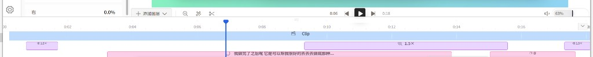
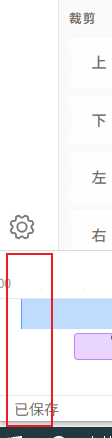
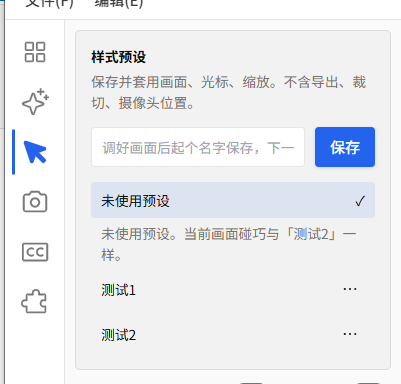

# 问题报告与记录清单

> 模式：**文档止**（调查根因，等确认再改代码）。  
> 截图真源：本夹三张附图（用户 2026-09-08 贴入对话，已拷入主题夹）。  
> 后说：时间轴右侧不得顶死屏幕（PR-05）。  
> `@terminals`：本轮未提供运行日志，根因以源码为准。

## 附图索引

文件与问题报告同目录，预览用相对路径。

| 编号 | 文件 | 拍到什么 | 支撑 |
|------|------|----------|------|
| 附图-01 | [附图-01-运输条与标尺.png](附图-01-运输条与标尺.png) | 运输条、标尺、播头、色块通到右缘 | PR-01、PR-02、PR-05 |
| 附图-02 | [附图-02-左缘侧栏红框.png](附图-02-左缘侧栏红框.png) | 左缘红框：齿轮、00、已保存同一竖条 | PR-01、PR-02、PR-03 |
| 附图-03 | [附图-03-光标页样式预设.png](附图-03-光标页样式预设.png) | 左轨光标选中，抽屉顶部「样式预设」 | PR-04 |

## 问题记录清单

| ID | 简述 | 严重程度 | 状态 | 附图 |
|----|------|----------|------|------|
| PR-01 | 时间标识区过宽、与色块不协调 | P1 | 方案待确认 | [01](附图-01-运输条与标尺.png) [02](附图-02-左缘侧栏红框.png) |
| PR-02 | 标尺顶与运输条重叠，左与侧栏重叠 | P0 | 方案待确认 | [01](附图-01-运输条与标尺.png) [02](附图-02-左缘侧栏红框.png) |
| PR-03 | 侧栏未通底，齿轮浮在时间轴上方，不像 VS Code | P0 | 方案待确认 | [02](附图-02-左缘侧栏红框.png) |
| PR-04 | 样式预设同时出现在场景与光标 | P2 | 方案待确认 | [03](附图-03-光标页样式预设.png) |
| PR-05 | 时间轴右缘顶死窗口，缺同类产品式留白 | P1 | **已被 PR-06 覆盖（后说：沟浪费）** | [01](附图-01-运输条与标尺.png) |

---

## 问题报告（PR-01）

| 字段 | 值 |
|------|----|
| 问题描述 | 时间轴标识时间的区域太宽，看起来不协调 |
| 发现场景 | 编辑器打开成片，时间轴展开 |
| 附图 | [附图-01](附图-01-运输条与标尺.png)、[附图-02](附图-02-左缘侧栏红框.png) |
| 根因分析 | 见 [`03`](03-调查_现状与根因.md) §2.1 |
| 严重程度 | P1 |
| 状态 | 方案待确认 |
| 关联 WP | 建议 WP-A（与 PR-02/03 同一次改壳） |
| @terminals | 无 |

### 现象

- 刻度行（0:00、0:02…）相对上方运输条显得厚。
- 窗口最左侧出现「00」和一条明显空白，色块从更靠右才开始（截图 2）。
- 培训师会觉得「时间数字占了一整条走廊」，和剪映「刻度贴着轨道」不一致。





### 根因（摘要）

1. **主因（水平）**：`EditorTimelinePanel` 是窗口通栏，0 时刻贴窗口左缘。左轨 48px + 抽屉 280/300px 盖在这段刻度上，可见区只剩「00 + 空白」，色块落在预览列。这不是 dnd `sidebarWidth`（本仓未 `setSidebarRef`，宽为 0）。
2. **次因（竖直）**：`TimelineAxis` 写死 `h-8`（32px），刻度是「圆点 + 数字」竖排（`mb-1.5` 圆点），比 `TIMELINE_AXIS_HEIGHT_PX = 28` 和 OpenScreen `.tlRuler` 28 更厚。

### 方案选项

见 [`04`](04-改善方案.md) S1。推荐：时间轴改到预览列、标尺收成 24–28px 单行数字、去掉圆点。

### @待确认

- [ ] 确认「太宽」按水平走廊 + 竖直偏厚一并修（推荐）

---

## 问题报告（PR-02）

| 字段 | 值 |
|------|----|
| 问题描述 | 时间标识区顶部压运输条，左侧压侧栏，间距未算 |
| 发现场景 | 播放头在标尺上；打开抽屉看裁剪 |
| 附图 | [附图-01](附图-01-运输条与标尺.png)、[附图-02](附图-02-左缘侧栏红框.png) |
| 根因分析 | 见 [`03`](03-调查_现状与根因.md) §2.2 |
| 严重程度 | P0 |
| 状态 | 方案待确认 |
| 关联 WP | 建议 WP-A |
| @terminals | 无 |

### 现象

- 运输条（添加图层 / 播放 / 音量）与标尺几乎贴死；蓝播头手柄顶到播放控件。
- 左缘「00」与齿轮、抽屉底边同一竖条，像叠在一起。
- 拖高抓手从时间轴向上探出 8px。


### 根因（摘要）

| 重叠 | 源码 |
|------|------|
| 标尺 ∩ 运输条 | 预览列 `gap-0`；运输条 `h-8`；时间轴紧接其下。抓手 `absolute -top-2 z-30 h-4`。播头手柄 `-top-1` 的 16×16 盒 + 菱形，再上还有 `-top-6` 时间气泡。 |
| 标尺 ∩ 左栏 | 时间轴通栏，左缘与左轨/抽屉同 x，不是 z-index 盖住抽屉内容，而是**占了左栏应向下延伸的地**。 |

### 方案选项

见 [`04`](04-改善方案.md) S2。推荐：列内时间轴 + 抓手改成列内顶边 4px、播头手柄关在标尺盒内。

### @待确认

- [ ] 运输条与标尺之间留 **4px** 安全缝（推荐）还是 8px

---

## 问题报告（PR-03）

| 字段 | 值 |
|------|----|
| 问题描述 | 侧栏应通底；时间轴不应压在侧栏上；齿轮应在左下，像 VS Code |
| 发现场景 | 任意编辑器主界面；用户红框标出左缘 |
| 附图 | [附图-02](附图-02-左缘侧栏红框.png) |
| 根因分析 | 见 [`03`](03-调查_现状与根因.md) §2.3 |
| 严重程度 | P0 |
| 状态 | 方案待确认 |
| 关联 WP | 建议 WP-A |
| @terminals | 无 |

### 现象

- 左轨只到预览区底。齿轮贴在时间轴顶缝，不像 VS Code 贴状态栏。
- 时间轴 + 底栏「已保存」占满窗口宽，切断左轨。
- 抽屉（场景/裁剪等）同样半腰截断。


### 根因（摘要）

`EditorShell.tsx` 结构是：

```text
列：Header
    列：  行(z-10)：左轨 + 抽屉 + 预览
        时间轴（通栏）
    底栏（通栏）
```

齿轮已在左轨 `justify-between` 底部，但左轨高度 = 预览行，不是窗口内容区全高。  
这是布局层级问题，不是少画一个图标。

### 方案选项

见 [`04`](04-改善方案.md) S3。推荐：**先左轨（通高）再内容列（预览+时间轴）**；底栏可通栏或只走内容列。

### @待确认

- [ ] 底栏是否让出左轨 48px（更像 VS Code）还是继续通栏（改动更小）——推荐让出左轨

---

## 问题报告（PR-04）

| 字段 | 值 |
|------|----|
| 问题描述 | 样式预设既在场景页，也在光标 tab |
| 发现场景 | 点左轨场景、再点光标 |
| 附图 | [附图-03](附图-03-光标页样式预设.png) |
| 根因分析 | 见 [`03`](03-调查_现状与根因.md) §2.4 |
| 严重程度 | P2 |
| 状态 | 方案待确认 |
| 关联 WP | 建议 WP-B（可与 WP-A 分 PR） |
| @terminals | 无 |

### 现象

- `StylePresetCard` 出现在「场景」面板顶部，也出现在「光标」面板顶部。同一张卡、同一套列表。
- 培训师会以为两处是两套预设，或觉得界面重复。



### 根因（摘要）

`SettingsPanel.tsx`：`sceneSectionContent` 开头挂 `stylePresetSlot`；`case "cursor"` 再次挂同一 slot。  
`frame` / `crop` 复用 `sceneSectionContent`，所以裁剪页也会带到这张卡。  
这是 `R20260907-01` **D8 故意双挂**（调完光标也能存），不是回归 bug。现诉求与旧决策冲突。

### 方案选项

见 [`04`](04-改善方案.md) S4。推荐：**只留场景页一张**（覆盖 D8）；光标页顶加一行「去场景保存样式」链，避免找不到。

### @待确认

- [ ] 覆盖 D8：预设只挂场景（推荐），还是维持双挂只改文案说明「同一份」

---

## 问题报告（PR-05）

| 字段 | 值 |
|------|----|
| 问题描述 | 时间轴右侧应预留空间，不应直接延伸到屏幕边沿 |
| 发现场景 | 编辑器最大化或贴边窗口；标尺/色块顶到窗口右 |
| 附图 | [附图-01](附图-01-运输条与标尺.png) |
| 根因分析 | 见 [`03`](03-调查_现状与根因.md) §1.6、§2.5 |
| 严重程度 | P1 |
| 状态 | 方案待确认 |
| 关联 WP | 建议 WP-A（与 PR-01～03 同一次改壳） |
| @terminals | 无 |

### 现象

- 标尺、色块、播头画到窗口最右像素，像「轨贴在屏幕边上」。
- 片尾时刻数字、折叠钮与窗口缩放热区挤在一起，不专业、也不好点。


### 根因（摘要）

`EditorTimelinePanel` 抓手 `left-0 right-0`；时间轴容器 `overflow-hidden` 且无 `padding-right`。折叠钮 `absolute right-2` 只让出 8px 给按钮，**刻度与色块仍铺满列宽**。S3 把时间轴收进预览列后，右缘仍是窗口右缘——左让位解决不了右贴边。

### 同类怎么做（习惯，不是抄像素）

| 产品 | 右缘常见做法 |
|------|----------------|
| 剪映 / CapCut 桌面 | 时间轴在**面板**里，面板与窗口右缘有铬条/圆角内边（约 8–16px）；片尾不顶 OS 边；右下常有缩放条，形成一条「工具沟」 |
| Premiere / DaVinci | 时间轴在 dock 面板内，有 1px 边框 + 面板内边距，内容不顶窗口 |
| Camtasia | 右侧滚动槽 + 数 px 内边，最后一帧不贴窗 |

本仓没有右侧属性栏，**不**为此新开右活动栏（过度设计）。对齐的是「面板不顶屏幕」，不是「右边再做一列设置」。

### 方案选项

见 [`04`](04-改善方案.md) S5。推荐：内容列右侧 **12px** 安全沟；标尺/轨道停在沟左；折叠钮放进沟里。

### @待确认

- [ ] 右沟 12px（推荐）/ 8px / 16px
- [ ] 运输条音量是否同一 12px 右对齐（推荐是）

---

## 可观测性

| 项 | 本夹 |
|----|------|
| UI 报错 | 不涉及新 API |
| 日志 | 不新增；布局用肉眼 + 量像素 |
| 自动验 | 布局单测：左轨 `bottom` ≥ 底栏顶；时间轴 `left` ≥ 左栏右；时间轴 `right` ≤ 窗口右 − 右沟；标尺高度常量与 DOM 一致 |
| 真机 | 见 [`14`](14-待确认代决策与待检验.md) §三 |
