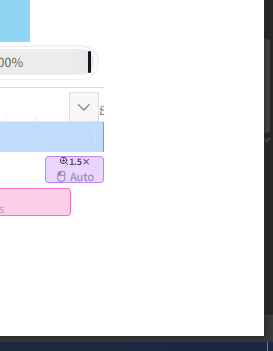
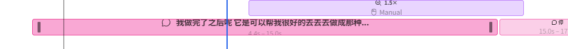
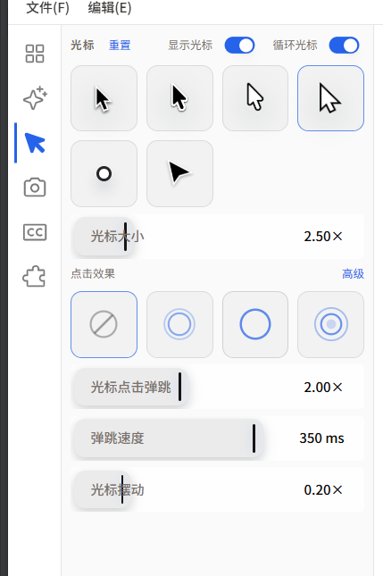
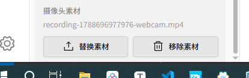
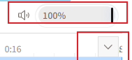

# 问题报告：改后复验（PR-06～PR-12）

> 模式：**文档止**。2026-09-08 壳层部分落地后，用户复验 + 六张新截图。  
> 后说覆盖先说：**PR-05 / D6 的 12px 右沟作废**，以本文件 PR-06 为准。  
> 规范真源仍认 `R20260907-02` 的 [`03-规范_编辑器专业视觉系统.md`](../R20260907-02-Recordly编辑器专业视觉系统/03-规范_编辑器专业视觉系统.md)，本夹不另起第三套皮。

## 附图索引（本批）

| 编号 | 文件 | 支撑 |
|------|------|------|
| 附图-04 | [附图-04-右缘留白与折叠钮.png](附图-04-右缘留白与折叠钮.png) | PR-06、PR-12 |
| 附图-05 | [附图-05-时间轴块内图标与文字.png](附图-05-时间轴块内图标与文字.png) | PR-07 |
| 附图-06 | [附图-06-齿轮左边距.png](附图-06-齿轮左边距.png) | PR-08 |
| 附图-07 | [附图-07-光标面板控件.png](附图-07-光标面板控件.png) | PR-09、PR-11（同类滑条） |
| 附图-08 | [附图-08-抽屉底部贴边.png](附图-08-抽屉底部贴边.png) | PR-08、PR-10 |
| 附图-09 | [附图-09-音量条与折叠钮.png](附图-09-音量条与折叠钮.png) | PR-11、PR-12 |

## 清单

| ID | 简述 | 严重程度 | 状态 | 附图 |
|----|------|----------|------|------|
| PR-06 | 右侧留白浪费空间（覆盖 PR-05） | P1 | 方案待确认 | [04](附图-04-右缘留白与折叠钮.png) |
| PR-07 | 时间轴块内多余图标、文字不垂直居中 | P1 | 方案待确认 | [05](附图-05-时间轴块内图标与文字.png) |
| PR-08 | 左下齿轮与左上图标左边距不一致 | P2 | 方案待确认 | [06](附图-06-齿轮左边距.png) [08](附图-08-抽屉底部贴边.png) |
| PR-09 | 抽屉控件圆角/阴影/图标过大，不像剪映 | P1 | 方案待确认 | [07](附图-07-光标面板控件.png) |
| PR-10 | 抽屉滚到底，控件贴窗口底 | P1 | 方案待确认 | [08](附图-08-抽屉底部贴边.png) |
| PR-11 | 预览音量条不像通用滑动条 | P1 | 方案待确认 | [09](附图-09-音量条与折叠钮.png) |
| PR-12 | 时间轴折叠钮方块+阴影过重 | P2 | 方案待确认 | [04](附图-04-右缘留白与折叠钮.png) [09](附图-09-音量条与折叠钮.png) |

---

## 问题报告（PR-06）

| 字段 | 值 |
|------|----|
| 问题描述 | 右侧留白没有必要，浪费空间 |
| 发现场景 | 改壳后内容列右侧空出一条白边；附图-04 |
| 根因分析 | `EditorShell.tsx` 内容列 `pr-3`（12px），即旧 D6 落地 |
| 严重程度 | P1 |
| 状态 | 方案待确认（**覆盖** PR-05 / D6） |
| 关联 WP | WP-A 补丁 |
| 附图 | [附图-04](附图-04-右缘留白与折叠钮.png) |

### 现象

轨和预览在窗口右缘前停住，中间一条空白。培训师觉得轨没用满。



### 根因

不是浏览器默认边距。是本夹先前推荐的「12px 右沟」已经写进 `className="… pr-3"`。剪映的「不顶屏」来自**窗口铬条/面板边框约 1px**，不是再空一指宽。后说：不要这条沟。

### 方案选项

- **A（推荐）**：去掉 `pr-3`。轨与预览贴内容列右缘。折叠钮用绝对定位叠在标尺右上，不占独立沟。最多留 **1px** 边线。
- B：改成 `pr-1`（4px）。仍浪费，不推荐。

### @待确认

- [ ] 确认废止 D6，按 A 收掉右沟

---

## 问题报告（PR-07）

| 字段 | 值 |
|------|----|
| 问题描述 | 时间轴块里不该有图标；文字应垂直居中；字号/位置要专业 |
| 发现场景 | 缩放块 1.5x + 鼠标 Auto/Manual；字幕块气泡图标 + 正文靠上 + 底行时码 |
| 根因分析 | `Item.tsx` 每种 variant 都画 Phosphor 图标；内容是 `flex-col` 两行 |
| 严重程度 | P1 |
| 状态 | 方案待确认 |
| 关联 WP | WP-C |
| 附图 | [附图-05](附图-05-时间轴块内图标与文字.png) |

### 现象

剪映块上只有时长色条和短字，没有放大镜/鼠标/气泡。本仓块里图标占角，字幕不垂直居中，时码 9px 低对比。



### 根因

`Item.tsx`：缩放/裁切/正片/变速/音频/字幕各绑一个图标；外层 `flex-col`：第一行标题+图标，第二行 Auto/Manual 或 `4.4s – 15.0s`。两行必然把主文顶到上半。字号 `clamp(7px, 2cqi, 11px)` + 时码 `text-[9px]`。块皮肤已是 3px（`ItemGlass`），问题在**内容构图**，不是再加大圆角。

### 方案选项

- **A（推荐）**：块内**零装饰图标**。一行字垂直水平居中：缩放只留 `1.5×`；字幕只留正文截断；正片只留 `Clip` 或片长；音频靠波形，字可省略。Auto/Manual、起止时码进 **tooltip**（悬停/选中才出现在块外或系统提示），不占块内第二行。字号统一 **11px**、`tabular-nums`、字重 500，行内 `px-1.5`。
- B：保留缩放倍率旁的小字、去掉图标，仍两行。居中做不到，不推荐。

不改切割/缩放数据，只改块上面画什么。

### @待确认

- [ ] 确认块内去图标 + 单行居中（A）

---

## 问题报告（PR-08）

| 字段 | 值 |
|------|----|
| 问题描述 | 左下齿轮与左上图标相对窗口左缘的边距不一致 |
| 发现场景 | 对照左轨顶栏图标与底栏齿轮；附图-06、08 |
| 根因分析 | 上组包在 `items-center` 里；齿轮是 `justify-between` 的直接子项，默认左对齐 |
| 严重程度 | P2 |
| 状态 | 方案待确认 |
| 关联 WP | WP-A 补丁 |
| 附图 | [附图-06](附图-06-齿轮左边距.png) [附图-08](附图-08-抽屉底部贴边.png) |

### 现象

齿轮看起来更贴窗口左边，和上面一列图标不在同一条垂直中线。


### 根因

`EditorSidebar.tsx`：轨是 `flex-col justify-between`，**没有** `items-center`。上面六个按钮包在 `<div className="flex flex-col items-center">` 里，在 48px 轨内居中。齿轮按钮 `h-9 w-9` 是第二段的直接孩子，交叉轴默认 `stretch`/`start`，贴左。按钮本身虽 `justify-center`，盒子已经偏左，视觉上齿更靠窗。

### 方案选项

- **A（推荐）**：轨根节点加 `items-center`；或齿轮外包一层同样的 `items-center`。上下同一条中线。
- B：改齿轮尺寸。治标。

### @待确认

- [ ] 确认只矫正对齐，不改 48px 轨宽

---

## 问题报告（PR-09）

| 字段 | 值 |
|------|----|
| 问题描述 | 各抽屉面板元素圆角过多、不该有的阴影、图标偏大、控件过复杂，不像剪映/OpenScreen |
| 发现场景 | 光标页：样式格 10px 圆角+投影、滑条胶囊、标签与拇指重叠；摄像头页按钮浮起 |
| 根因分析 | `SliderControl` 仍是 h-10 + rounded-xl + 投影；规范已写但未吃完 |
| 严重程度 | P1 |
| 状态 | 方案待确认 |
| 关联 WP | WP-D（控件皮，单独立项实施时可再拆） |
| 附图 | [附图-07](附图-07-光标面板控件.png) |

### 现象

滑条把标签画进胶囊，拇指竖线压住「光标大小」。光标样式格又圆又鼓。按钮带投影。图标 24px（左轨 `h-6`）相对抽屉 11–12px 字偏大。整体像消费级小工具，不像剪映/OpenScreen 的扁控件。



### 根因（设计师视角）

`R20260907-02/03` 已锁：直角默认、控件半径 2、媒体 3、**禁胶囊、禁 chrome 投影**、滑条单行 28：标签 \| 扁轨 \| 值。  
现状：`SliderControl` `h-10 rounded-xl` + 填充条 `shadow-[0_4px_10px…]` + 标签在轨内；光标格仍 `rounded-[10px]`（SettingsPanel 约 3320 行）；主按钮仍带浮起阴影。抽屉外壳已有 `[&_.rounded-xl]:rounded-[4px]` 这种「事后削圆」，削不掉结构问题。

左轨图标 24px 在 48px 轨上可用；抽屉里的 16–20px 装饰图标才和 11px 标签失调。本条管**抽屉/运输条控件**，不把左轨图标强行缩到 16（VS Code 也是约 24）。

### 方案选项

- **A（推荐）**：按已有规范改，不新发明。`SliderControl` 改成三列单行（标签 72 \| 4px 高扁轨+2px 半径拇指 \| 值 44），无投影。光标/点击效果格改为 3px、无阴影、选中 1px 蓝边。主/次按钮高 28、半径 2、无 `shadow-*`。分段/色板同规范。开关保留（系统习惯）。
- B：只改光标页。其它页仍两套脸。不推荐。

范围闸门：只动编辑器抽屉 + 运输条上同类控件；不改 Launch、不改成片摄像头圆角。预估可控；若单 PR 要过 500 行，按面板拆（光标 / 场景 / 摄像头 / 字幕）。

### @待确认

- [ ] 确认以 `R20260907-02/03` 为皮的唯一尺子，本夹只写「未落地项」清单并实施

---

## 问题报告（PR-10）

| 字段 | 值 |
|------|----|
| 问题描述 | 控制面板滚到底，元素贴屏幕/窗口底，没有呼吸 |
| 发现场景 | 摄像头素材「替换/移除」贴抽屉底和任务栏；附图-08 |
| 根因分析 | 滚动区 `p-2 pb-0`；侧栏通底后抽屉底 = 窗口底 |
| 严重程度 | P1 |
| 状态 | 方案待确认 |
| 关联 WP | WP-A 补丁 或随 WP-D |
| 附图 | [附图-08](附图-08-抽屉底部贴边.png) |

### 现象

滚动条拉死，最后一排按钮贴死底边，像被裁切。资深 UX：列表/表单滚到底必须有**底内边**，否则最后一项像没做完。



### 根因

`SettingsPanel` 滚动容器：`p-2 pb-0`。`pb-0` 是为了给底部「删除片段」固定条让位；没有固定条的页（光标、摄像头、场景）滚到底就是 0。侧栏通高之后，这 0 直接顶窗口。

### 方案选项

- **A（推荐）**：滚动内容 `padding-bottom: 12px`（`--ed-space-3`）。有底部固定操作条时，再加一条高度，避免双空。项目抽屉同样处理。
- B：16px。略松，规范抽屉内不拿 16 当默认，次选。

### @待确认

- [ ] 底垫 12px（A）

---

## 问题报告（PR-11）

| 字段 | 值 |
|------|----|
| 问题描述 | 音量控件不像通用滑动条，看起来奇怪 |
| 发现场景 | 运输条右侧胶囊里写 100%、竖线拇指、看不见完整轨 |
| 根因分析 | `EditorPreviewPanel` 自制 pill + 隐藏 `input[type=range]`，与 `SliderControl` 同一套错视觉 |
| 严重程度 | P1 |
| 状态 | 方案待确认 |
| 关联 WP | WP-C 或与 PR-09 同改 `Slider` 原子 |
| 附图 | [附图-09](附图-09-音量条与折叠钮.png) |

### 现象

用户要「大家一看就懂的滑动条」。现在是药丸槽 + 百分比印在槽里 + 黑竖线，没有「细轨 + 可辨认拇指」。



### 根因

运输条音量：`h-7 w-24 rounded-full` + 内填充 + 竖线 + 槽内 `100%` + 透明 range。这是自定义展示，不是标准 slider 心智。

### 方案选项

- **A（推荐）**：喇叭图标（静音切换）+ **扁轨滑动条**（高 4px、半径 2、品牌蓝填充）+ 小圆或 8×12 竖条拇指 + **百分比在轨右侧**（不进轨内）。仍放运输条最右（剪映/Premiere 也在预览附近），宽约 88–104px，行高 28，与播放钮对齐。无胶囊、无内阴影、无发光。
- B：做成系统 `input[type=range]` 默认皮。懂，但不美观。

### @待确认

- [ ] 位置仍在运输条右侧（A）；不要搬到时间轴左

---

## 问题报告（PR-12）

| 字段 | 值 |
|------|----|
| 问题描述 | 收起/展开时间轴按钮太浓：方块底 + 阴影 |
| 发现场景 | 标尺右上灰色方钮；附图-04、09 |
| 根因分析 | `EditorTimelinePanel` `h-6 w-6 border bg-editor-surface` |
| 严重程度 | P2 |
| 状态 | 方案待确认 |
| 关联 WP | WP-A 补丁 |
| 附图 | [附图-04](附图-04-右缘留白与折叠钮.png) [附图-09](附图-09-音量条与折叠钮.png) |

### 现象

用户要「小小图标，不要方块、不要阴影」。现在是带边框的浮块，压在标尺上。

### 根因

```150:153:src/components/video-editor/layout/EditorTimelinePanel.tsx
className="absolute right-1 top-1 z-20 inline-flex h-6 w-6 items-center justify-center border border-foreground/10 bg-editor-surface …"
```

无 `shadow-*` class，但边框+实底在浅色标尺上像浮块。

### 方案选项

- **A（推荐）**：只留 Caret 图标（16px），透明底、无边框、无阴影。`hover` 仅变色。热区可仍 24px 以免难点。位置：标尺行内右上，不另开沟（配合 PR-06）。
- B：做成和运输条 ghost 一样的 7×7 空按钮。略重于 A。

### @待确认

- [ ] 确认纯图标（A）
