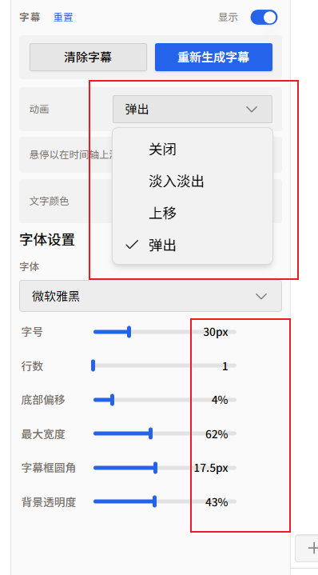
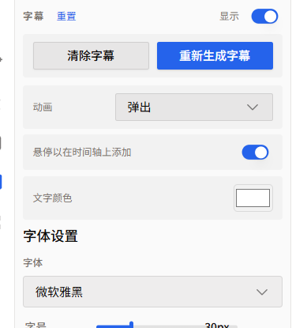
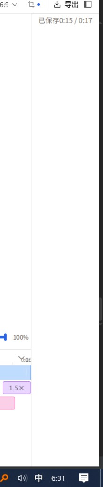
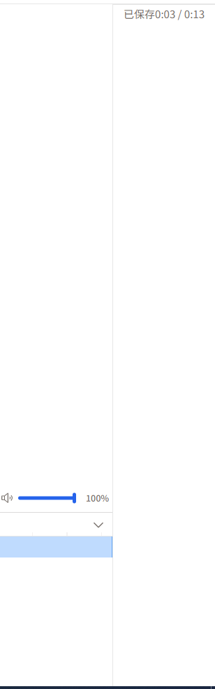
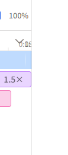
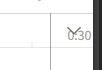
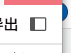

# 问题报告（PR-01～08）

> 文档止。证据为本夹附图。与 `R20260908-03` 的右沟/滑条皮相关但不合并，以免把「空列」再错写成 12px 沟。  
> **决策**：各 PR 推荐项已锁定，见 [`14`](14-待确认代决策与待检验.md) / [`04`](04-改善方案.md)。下文「@待确认」改为已锁定。

## 附图索引

| 编号 | 文件 | 支撑 |
|------|------|------|
| 01 | [附图-01-字幕滑条叠字与下拉.png](附图-01-字幕滑条叠字与下拉.png) | PR-01、PR-02、PR-05 |
| 02 | [附图-02-右侧空列与底栏.png](附图-02-右侧空列与底栏.png) | PR-03、PR-04、PR-06 |
| 06 | [附图-06-右侧空列与顶上时间.png](附图-06-右侧空列与顶上时间.png) | PR-03 复验（时刻贴列顶） |
| 07 | [附图-07-折叠钮叠片尾时刻.png](附图-07-折叠钮叠片尾时刻.png) | PR-04 复验（箭头压 0:30） |
| 03 | [附图-03-标尺字与折叠重叠.png](附图-03-标尺字与折叠重叠.png) | PR-04 |
| 04 | [附图-04-字幕页字号叠轨.png](附图-04-字幕页字号叠轨.png) | PR-01、PR-02、PR-05 |
| 05 | [附图-05-顶栏右侧抽屉钮.png](附图-05-顶栏右侧抽屉钮.png) | PR-08 |

## 清单

| ID | 简述 | 级 | 状态 | 附图 |
|----|------|----|------|------|
| PR-01 | 滑条文字与轨重叠 | P0 | 已锁定 D1，待施工 | 01、04 |
| PR-02 | 下拉项字号突然变大 | P1 | 已锁定 D2，待施工 | 01、04 |
| PR-03 | 窗口右侧空出一大列 | P0 | **已修**：footer 归内容列底 | 02、06 |
| PR-04 | 时间轴左右缘不雅、字与折叠钮重叠 | P0 | **已修**：折叠入右侧 24px 槽 | 02、03、07 |
| PR-05 | 抽屉行高过大、下拉带阴影 | P1 | 已锁定 D5，待施工 | 01、04 |
| PR-06 | 预览/边缘该黏连却留空，该用分割线 | P1 | 已锁定 D6，待施工 | 02 |
| PR-07 | 关抽屉后再点左轨，面板无效果 | P0 | 已锁定 D7，待施工 | —（逻辑） |
| PR-08 | 抽屉开关放在顶栏右上、挨着导出 | P1 | 已锁定 D8，待施工 | 05 |

---

## PR-01 滑条叠字

| 字段 | 值 |
|------|----|
| 现象 | 「字号」被蓝轨压住；右侧 `30px` / `1` 贴轨甚至压轨 |
| 根因 | `SliderControl` 现为 `grid-cols-[72px_1fr_44px]`。中文标签（底部偏移、字幕框圆角、背景透明度）宽于 72px，溢出盖到绝对定位的轨（`left-[74px]`）。值列 44px 装不下 `30px`/`100%`。轨是 `position:absolute`，不参与网格，更容易和字抢同一条带。 |
| 方案 | **A（推荐）**：标签列改为 `minmax(72px, max-content)` 或固定 88px；值列 52px；**轨只画在中间格**（不要 absolute 相对整行）。标签/值不再和轨共层。 |
| 附图 |   |

### 决策

已锁定 D1：轨进中间格，标签 88、值 52。

---

## PR-02 下拉字号跳变

| 字段 | 值 |
|------|----|
| 现象 | 关上的「动画 / 微软雅黑」是小字；打开后「关闭 / 淡入淡出 / 微软雅黑」明显更大更粗 |
| 根因 | 抽屉里 `SelectTrigger` 被写成 `text-xs`（12px）。`src/components/ui/select.tsx` 默认 `SelectItem` 是 `text-sm`（14px），`SelectLabel` 还 `font-semibold`。Portal 弹出层不吃抽屉的 `text-xs`。 |
| 方案 | **A**：编辑器内 Trigger / Item / Viewport 统一 `text-[12px] font-medium`，行高 28。不要混 xs/sm。 |

### 决策

已锁定 D2：统一 12px。

---

## PR-03 右侧空列

| 字段 | 值 |
|------|----|
| 现象 | 主区右边一条竖线，再往右约 1/3 全白；「已保存 0:15/0:17」贴在主区右缘 |
| 根因 | `EditorShell.tsx` 主行是横向 flex：`左轨+抽屉 | 预览+时间轴 | footer`。底栏被当成**第三列**，不再在窗口底下。该列被拉高后中间全空，看起来像空面板。这不是 12px 沟（`pr-3` 已不在），也不是再「预留右边」。 |
| 方案 | **已锁定**：底栏移出横向主行，放在内容列最底；左轨通窗底。禁止第三列、禁止窗口右沟。 |
| 附图 |   |

### 决策

已锁定 D3：footer 归内容列底。2026-09-08 已改 `EditorShell`：footer 移入内容列、去掉内容列 `border-r`（那条竖线是假右栏边）。

---

## PR-04 时间轴边缘与叠字

| 字段 | 值 |
|------|----|
| 现象 | 片尾色块顶在竖线上；`0:08`/`0:09` 被折叠箭头挡住 |
| 根因 | 折叠钮 `absolute right-1 top-0` 叠在标尺最后一刻度上。轨画满列宽，没有**画布内**边。03 夹曾用窗口 `pr-3` 当「优雅」，复验已否。 |
| 方案 | **A（推荐）**：标尺与轨道 **content padding 8px**（左右），刻度/色块从垫后的原点算，避免 seek 错位。折叠钮放在右内边里，或占标尺行一个 16px 槽，**不**和时刻数字抢像素。窗口级右沟 = 0。 |
| 附图 |   |

### 决策

已锁定 D4。2026-09-08 已改：折叠钮离开 `absolute` 叠层，改到标尺右侧 24px 槽（与轴同高），片尾 `0:30` 不再被箭头压住。

---

## PR-05 抽屉不简洁：阴影与行高

| 字段 | 值 |
|------|----|
| 现象 | 下拉弹出带投影；字幕页一屏装不下；「微软雅黑」触发器也显得鼓 |
| 根因 | `SelectContent` 默认 `shadow-md rounded-md` + 项 `py-1.5`。`SelectTrigger` 组件默认 `h-10`；字幕字体触发器仍 `h-8 rounded-md`。章节 `space-y-4`、卡片 `py-3`。规范要行高 28、半径 2、`--ed-shadow-chrome: none`。 |
| 方案 | **A**：编辑器 Select：无 shadow、半径 2、Trigger 高 28、Item 高 28。章节间距 8px。双按钮「清除 / 重新生成」改 28 高、半径 2。 |

---

## PR-06 预览黏连与分割

| 字段 | 值 |
|------|----|
| 现象 | 预览、运输条、时间轴、右缘之间有「空气」；6:9 时画面更像浮在白纸上 |
| 根因 | 内容列 `gap-1`；预览内 `px-1`；再加 PR-03 空列，边缘全是缝。规范：接缝 1px，工作区不垫 16px。 |
| 方案 | **A**：内容列 `gap-0` + 1px `border`。预览视口 `px-0`，画面贴左（抽屉）和贴轨。用线区分，不用空白区分。画幅两边的信箱是比例计算，不是再加 padding。 |

---

## PR-07 关抽屉后「看不到效果」

| 字段 | 值 |
|------|----|
| 现象 | 顶栏关掉抽屉后，再点左轨场景/光标/字幕，右边仍是空的，像没反应 |
| 根因 | `settingsPanelVisible` 为 false 时 `EditorSidebar` **不挂载** `SettingsPanel`。左轨 `setActiveSection` **不会**把 visible 设回 true。只有空项目 `onEmptyWorkspace` 会打开。预览上的光标/字幕**数据还在**（不是效果被卸掉），用户看到的是「面板没出来」。 |
| 方案 | **A（推荐）**：点左轨任一图标 → `setActiveSection` **且** `setSettingsPanelVisible(true)`。关抽屉只藏板，不卸预览状态。再点**当前**已选图标 = 关抽屉（VS Code 同款）。齿轮同样。 |
| B | 关抽屉时左轨禁用。更差，不采用。 |

### 决策

已锁定 D7：点左轨必开，再点当前则关。

---

## PR-08 抽屉钮在右上角

| 字段 | 值 |
|------|----|
| 现象 | 「导出」旁边一颗「左侧栏」图标，点了却管左边抽屉 |
| 根因 | `EditorHeader.tsx` 右侧：画幅 / 裁剪 / 导出 / `SidebarSimple`。语义是左栏，位置是右上。 |
| 方案 | **已锁定 D8**：删除顶栏钮；不另做齿轮上方窄钮。 |
| 附图 |  |

### 决策

已锁定 D8：删除顶栏 `SidebarSimple`。
